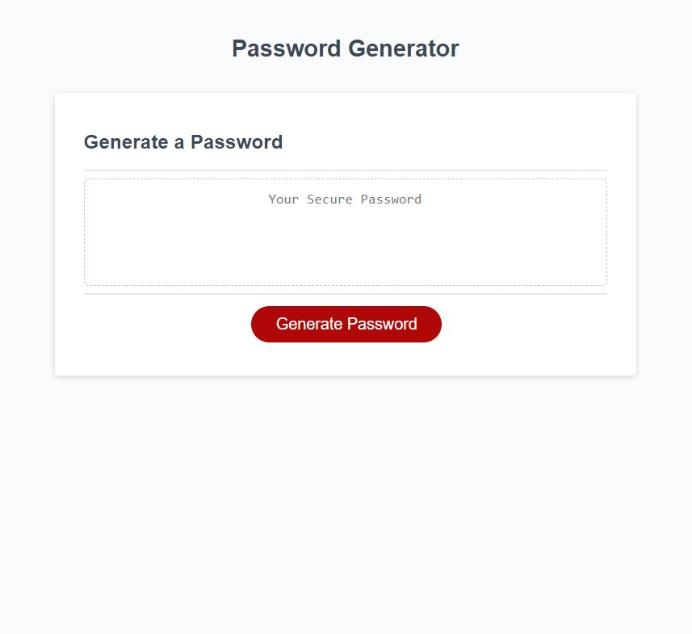

#Easy-Password-Generator
CWRU Homework Assignment #3

This is the third homework assignment for the CWRU Coding bootcamp. 

For this project we are assigned the functionality of a password generator. Users must be able to choose password length and all of the specific types of characters that they would like to be included. 

Github repository: (https://github.com/forgetfulmind/Easy-Password-Generator.git)
Deployed Website: (https://forgetfulmind.github.io/Easy-Password-Generator)

